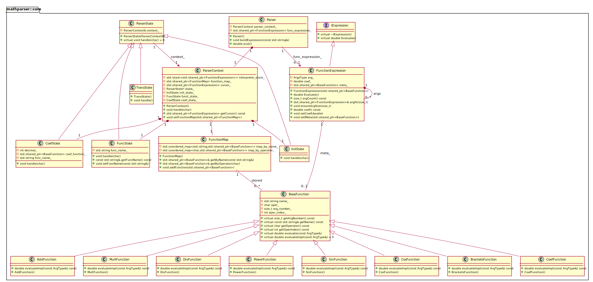

# mathparser
A simple math expression parser and evaluator written in c++ that showcase an implementation of various design patterns.


## Build and Run

To build and run the mathparser executable, use the following commands:

```bash
./scripts/build.sh mathparser_exe
./install/bin/mathparser_exe
```

## Design patterns
This project intentionally uses several well-known design patterns to make the parser modular and easy to extend:

- **Composite** — `IExpression` and `FunctionExpression` form a composite structure so expressions can contain nested sub-expressions (children are stored in `FunctionExpression::arg_`).
- **Strategy** — The `BaseFunction` class defines an interface for a function's evaluation; concrete functions (`AddFunction`, `MultFunction`, `SinFunction`, etc.) implement `evaluateImpl`, letting behavior vary independently of the expression tree.
- **State** — The parser uses `ParserState` and concrete states (`InitState`, `FuncState`, `CoefState`, `TransState`) to manage parsing behavior depending on the current context.
- **Interpreter** — `Parser` and `FunctionExpression::Evaluate()` implement an interpreter-like pattern to evaluate parsed expressions.
- **Registry / Factory** — `FunctionMap` registers function implementations and provides lookup by name or operator; this central registry simplifies function creation and lookup.

### UML diagram
The class diagram is available in `docs/uml/mathparser_core.puml` (PlantUML). You can render it locally (requires PlantUML and Graphviz):

```bash
# SVG
plantuml -tsvg docs/uml/mathparser_core.puml
# PNG
plantuml -tpng docs/uml/mathparser_core.puml
```



Source: `docs/uml/mathparser_core.puml`. A PNG version is also available at `docs/uml/mathparser_core.png`.

